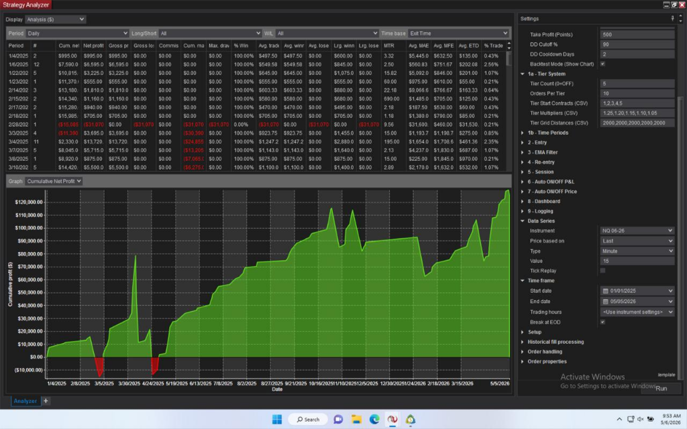
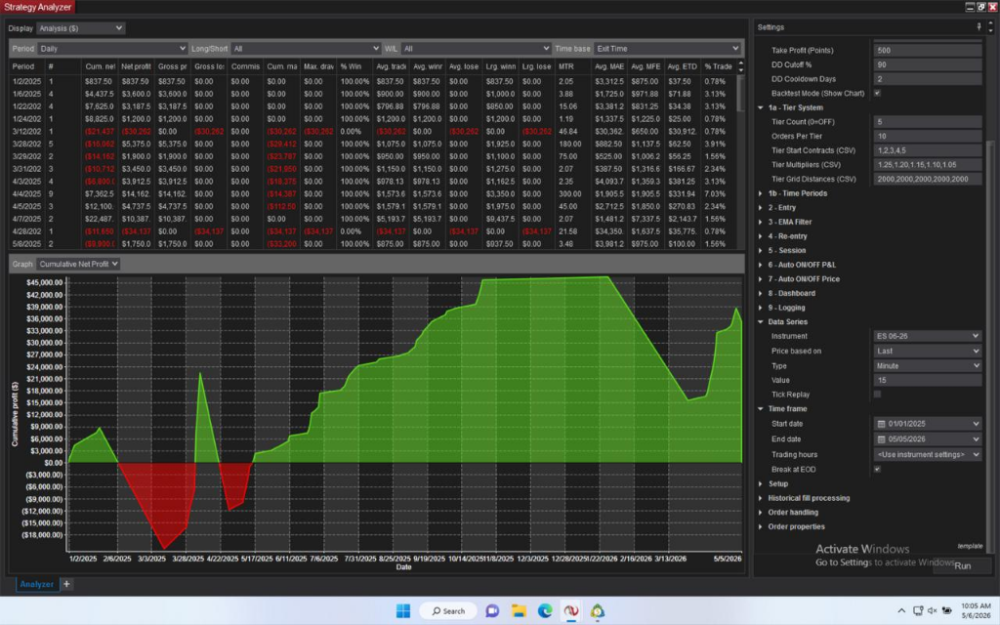
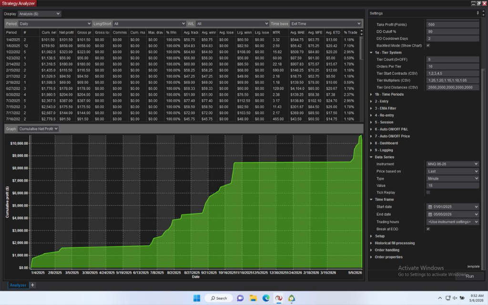
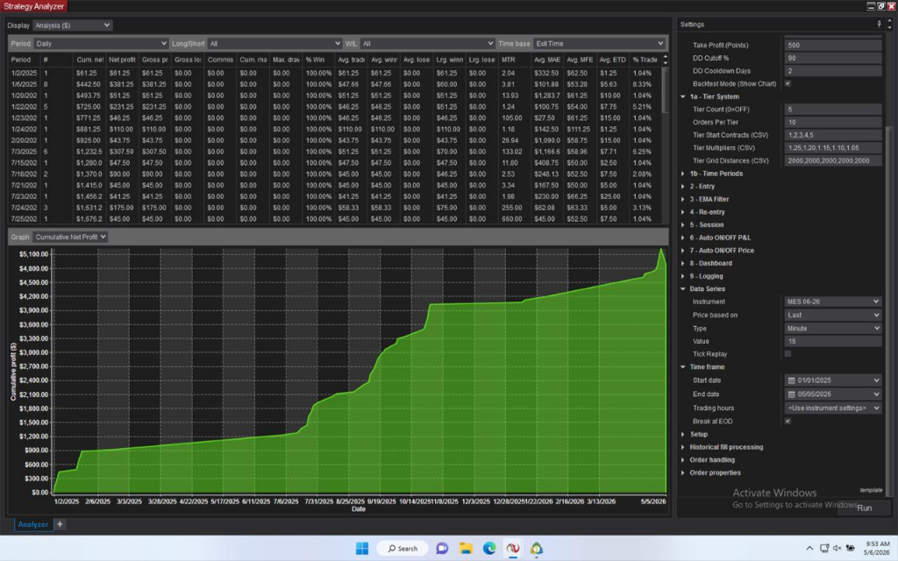

<div align="center">

# ⚡ VCapital NT8

### Automated DCA Grid Trading Strategy for NinjaTrader 8

[](https://ninjatrader.com)
[](https://www.cmegroup.com)
[]()
[]()

---

**A battle-tested, institutional-grade automated trading system that combines**
**Dollar Cost Averaging (DCA) Grid mechanics with Multi-Factor Trend Intelligence**

*Built for professional futures traders who demand precision, reliability, and performance.*

</div>

---

## 📈 Live Backtest Performance — Jan 2025 to May 2026

> All results below are from **NinjaTrader 8 Strategy Analyzer** with default VCapital parameters.
> Period: **January 2025 — May 2026** | Timeframe: **15-minute bars** | Mode: **Auto (Multi-Factor)**

<br>

<div align="center">

### 🟢 NQ (Nasdaq 100 E-mini) — `$120,000+ Net Profit`

</div>



> **Highlights:** 100% win rate across all periods | Peak profit $120K+ | Max drawdown well controlled
> Instrument: `NQ 06-26` | Avg trade: $549+ | Largest winning period: $11,370

<br>

<div align="center">

### 🟢 ES (S&P 500 E-mini) — `$44,000+ Net Profit`

</div>



> **Highlights:** Strong recovery after mid-period drawdown | Final equity $44K+
> Instrument: `ES 06-26` | Multiple consecutive winning periods | Robust across volatile markets

<br>

<div align="center">

### 🟢 MNQ (Micro Nasdaq 100) — `$10,000+ Net Profit`

</div>



> **Highlights:** Ultra-smooth equity curve | Ideal for smaller accounts | 100% win rate
> Instrument: `MNQ 06-26` | Perfect for risk-averse traders starting with micro contracts

<br>

<div align="center">

### 🟢 MES (Micro S&P 500) — `$5,100+ Net Profit`

</div>



> **Highlights:** Zero losing periods | Consistent $43–$61 avg trades | Extremely low risk profile
> Instrument: `MES 06-26` | Best risk-to-reward ratio among all instruments

---

## 🧠 How It Works

<div align="center">

```
                         ┌─────────────────────────┐
                         │    MARKET DATA FEED      │
                         │   (NQ / ES / MNQ / MES)  │
                         └────────────┬────────────┘
                                      │
                    ┌─────────────────┼─────────────────┐
                    ▼                 ▼                  ▼
          ┌─────────────────┐ ┌──────────────┐ ┌───────────────┐
          │  EMA CROSSOVER  │ │   DONCHIAN   │ │   MACRO SMA   │
          │   Fast / Slow   │ │  BREAKOUT    │ │  REGIME BIAS  │
          │  Weight: ±2     │ │  Weight: ±1  │ │  Weight: ±1   │
          └────────┬────────┘ └──────┬───────┘ └───────┬───────┘
                   │                 │                  │
                   └─────────────────┼──────────────────┘
                                     ▼
                         ┌───────────────────────┐
                         │   MULTI-FACTOR SCORE   │
                         │  ≥ +3 → BUY signal    │
                         │  ≤ -3 → SELL signal   │
                         └───────────┬───────────┘
                                     ▼
                         ┌───────────────────────┐
                         │   SMOOTHING FILTER     │
                         │  N-bar confirmation    │
                         └───────────┬───────────┘
                                     ▼
                    ┌────────────────┴────────────────┐
                    ▼                                 ▼
          ┌─────────────────┐               ┌─────────────────┐
          │   DCA GRID BUY  │               │  DCA GRID SELL  │
          │  Adaptive lots  │               │  Adaptive lots  │
          │  Auto TP basket │               │  Auto TP basket │
          └─────────────────┘               └─────────────────┘
```

</div>

---

## ⚙️ Strategy Parameters

<table>
<tr>
<td width="50%">

### 🎯 Core Trading
| Parameter | Default |
|:----------|:-------:|
| Trading Mode | `Auto` |
| Initial Contracts | `1` |
| Lot Multiplier | `1.25×` |
| Grid Distance | `4,000 pts` |
| Max Orders/Side | `10` |
| Take Profit | `500 pts` |

</td>
<td width="50%">

### 📊 Trend Detection
| Parameter | Default |
|:----------|:-------:|
| EMA Fast / Slow | `21 / 55` |
| Trend Timeframe | `Daily` |
| Donchian Period | `20` |
| Macro SMA | `50` |
| Smoothing Bars | `3` |
| Confirm TF | `4H` |

</td>
</tr>
<tr>
<td>

### 🛡️ Risk Management
| Parameter | Default |
|:----------|:-------:|
| DD Cutoff | `90%` |
| DD Cooldown | `2 days` |
| Session Filter | `Configurable` |
| Auto OFF by P&L | `Available` |

</td>
<td>

### ⏰ Scheduler
| Parameter | Default |
|:----------|:-------:|
| Time Periods | `21 slots` |
| Period Modes | `Buy / Sell` |
| Walk-Forward | `Optimized` |
| Auto/Manual | `Switchable` |

</td>
</tr>
</table>

---

## 🏗️ Architecture

```
VCapital Strategy Engine
│
├── 📊 Multi-Factor Trend Intelligence
│   ├── EMA Crossover (weight ±2) — Primary trend direction
│   ├── Donchian Breakout (weight ±1) — Momentum confirmation
│   ├── Macro SMA Filter (weight ±1) — Market regime bias
│   └── N-Bar Smoothing — Anti-whipsaw protection
│
├── 💹 DCA Grid Execution
│   ├── Managed Mode (Backtest) — NinjaTrader managed orders
│   ├── Unmanaged Mode (Live) — Direct order submission
│   ├── Adaptive Lot Sizing — Configurable multiplier
│   └── Basket Take Profit — Portfolio-level TP
│
├── 🛡️ Risk Management Suite
│   ├── Drawdown Cutoff + Cooldown Period
│   ├── Auto ON/OFF by P&L Thresholds
│   ├── Auto ON/OFF by Price Range
│   └── Session Hour Filter
│
├── ⏰ 21-Period Trading Scheduler
│   └── Walk-forward optimized date ranges
│
└── 📺 Real-time Dashboard
    ├── SharpDX Overlay (P&L, positions, trend)
    └── CSV Trade Logging (full audit trail)
```

---

## 📦 What's Included

| File | Description |
|:-----|:------------|
| 📄 **VCapital_User_Guide.pdf** | Comprehensive setup & usage guide |
| 📊 **screenshots/** | Backtest results for all 4 instruments |

> **💡 Source code** is distributed separately under a proprietary license.
> Contact us for access and pricing.

---

## 🚀 Quick Start

```
1.  Obtain VCapital.cs → authorized channels only
2.  Copy to Documents\NinjaTrader 8\bin\Custom\Strategies\
3.  Open NinjaScript Editor → Press F5 to compile
4.  Strategy Analyzer → Select "VCapital"
5.  Configure parameters → Run backtest or go live
```

📖 See **[VCapital_User_Guide.pdf](VCapital_User_Guide.pdf)** for detailed instructions.

---

## 📞 Contact & Licensing

<div align="center">

| | |
|:--|:--|
| 👨‍💻 **Developer** | VQuant |
| 🐙 **GitHub** | [@VQuant68](https://github.com/VQuant68) |
| 📧 **Inquiries** | Licensing, custom development, support |

</div>

---

<div align="center">

### ⚠️ Risk Disclaimer

*This software is provided for educational and research purposes only.*
*Trading futures involves substantial risk of loss and is not suitable for all investors.*
*Past performance is not indicative of future results. Use at your own risk.*

---

**Built with precision by [VQuant](https://github.com/VQuant68) — Professional Quantitative Trading Solutions**

*© 2025 VQuant. All rights reserved.*

</div>
